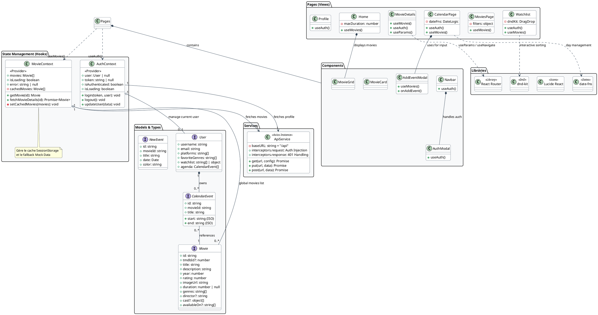

# Diagramme de Classes Front-end - Cinemate

Ce fichier contient le code source PlantUML du diagramme de l'architecture frontend (React/TypeScript), converti depuis une définition Mermaid.

```plantuml
@startuml Cinemate_Frontend_Detailed_Architecture

' --- CONFIGURATION ---
skinparam shadowing false
skinparam RoundCorner 10
skinparam class {
    BackgroundColor #FFFFFF
    ArrowColor #2C3E50
    BorderColor #2C3E50
}
skinparam package {
    BackgroundColor #F8F9FA
}

' --- MODELS & INTERFACES (TypeScript) ---

package "Models & Types" {
    interface User {
        + username: string
        + email: string
        + platforms: string[]
        + favoriteGenres: string[]
        + watchlist: string[] | object
        + agenda: CalendarEvent[]
    }

    interface Movie {
        + id: string
        + tmdbId?: number
        + title: string
        + description: string
        + year: number
        + rating: number
        + imageUrl: string
        + duration: number | null
        + genres: string[]
        + director?: string
        + cast?: object[]
        + availableOn?: string[]
    }

    interface CalendarEvent {
        + id: string
        + movieId: string
        + title: string
        + start: string (ISO)
        + end: string (ISO)
    }

    interface NewEvent {
        + id: string
        + movieId: string
        + title: string
        + date: Date
        + color: string
    }
}

' --- STATE MANAGEMENT (React Contexts) ---

package "State Management (Hooks)" {
    class AuthContext {
        <<Provider>>
        + user: User | null
        + token: string | null
        + isAuthenticated: boolean
        + isLoading: boolean
        + login(token, user): void
        + logout(): void
        + updateUser(data): void
    }

    class MovieContext {
        <<Provider>>
        + movies: Movie[]
        + isLoading: boolean
        + error: string | null
        - cachedMovies: Movie[]
        + getMovie(id): Movie
        + fetchMovieDetails(id): Promise<Movie>
        - setCachedMovies(movies): void
    }
    
    note bottom of MovieContext : Gère le cache SessionStorage\net le fallback Mock Data
}

' --- SERVICES & INFRASTRUCTURE ---

package "Services" {
    class ApiService <<Axios Instance>> {
        - baseURL: string = "/api"
        + interceptors.request: Auth Injection
        + interceptors.response: 401 Handling
        + get(url, config): Promise
        + put(url, data): Promise
        + post(url, data): Promise
    }
}

' --- COMPONENTS (Reusables) ---

package "Components" {
    class Navbar {
        + useAuth()
    }
    class AddEventModal {
        + useMovies()
        + onAddEvent()
    }
    class AuthModal {
        + useAuth()
    }
    class MovieCard
    class MovieGrid
}

' --- PAGES (Route Components) ---

package "Pages (Views)" {
    class Home {
        + useMovies()
        - maxDuration: number
    }
    class MoviesPage {
        + useMovies()
        - filters: object
    }
    class MovieDetails {
        + useMovies()
        + useAuth()
        + useParams()
    }
    class Watchlist {
        + useAuth()
        + useMovies()
        - dndKit: DragDrop
    }
    class CalendarPage {
        + useAuth()
        + useMovies()
        - dateFns: DateLogic
    }
    class Profile {
        + useAuth()
    }
}

' --- EXTERNAL LIBRARIES (Dependencies) ---

package "Libraries" {
    class "React Router" <<Library>>
    class "Lucide React" <<Icons>>
    class "dnd-kit" <<DnD>>
    class "date-fns" <<Dates>>
}

' --- RELATIONS & CARDINALITÉS ---

' Core Relations
User "1" *-- "0..*" CalendarEvent : owns
CalendarEvent "0..*" -- "1" Movie : references

' Contexts to Services
AuthContext "1" --> "1" ApiService : fetches profile
MovieContext "1" --> "1" ApiService : fetches movies

' Contexts to Models
AuthContext "1" o-- "0..1" User : manage current user
MovieContext "1" o-- "0..*" Movie : global movies list

' Pages to Hooks (Usage)
Pages ..> "useAuth()" AuthContext
Pages ..> "useMovies()" MovieContext

' Specific Page Dependencies
Watchlist ..> "dnd-kit" : interactive sorting
CalendarPage ..> "date-fns" : day management
MovieDetails ..> "React Router" : useParams / useNavigate

' Components Usage
Pages *-- Components : contains
CalendarPage *-- AddEventModal : uses for input
Home *-- MovieGrid : displays movies
Navbar *-- AuthModal : handles auth

@enduml
```
